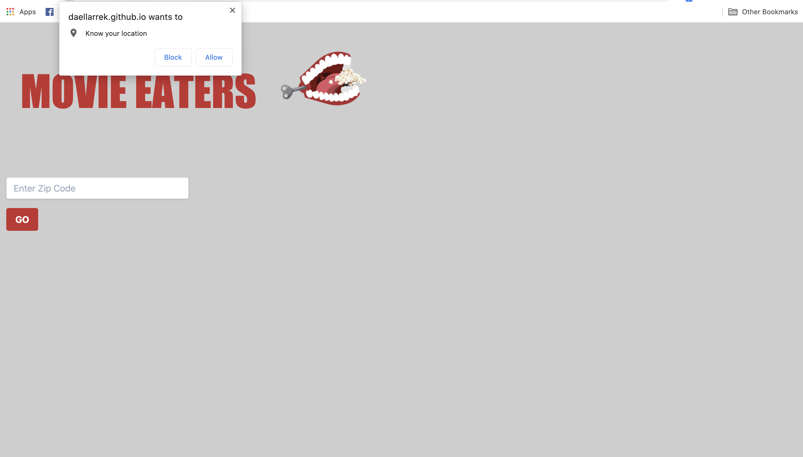
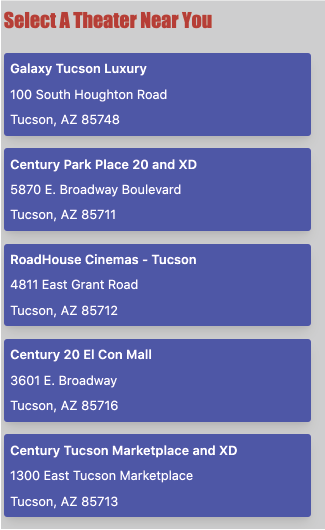
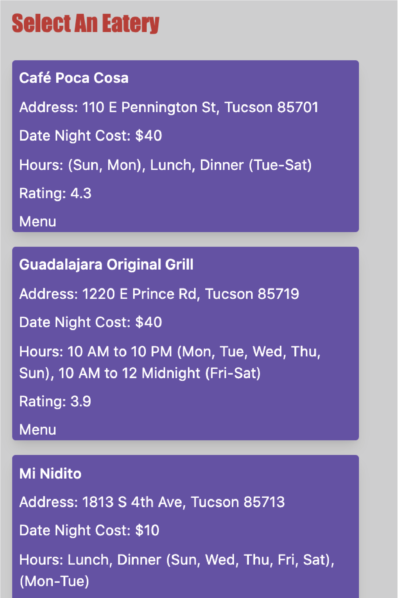
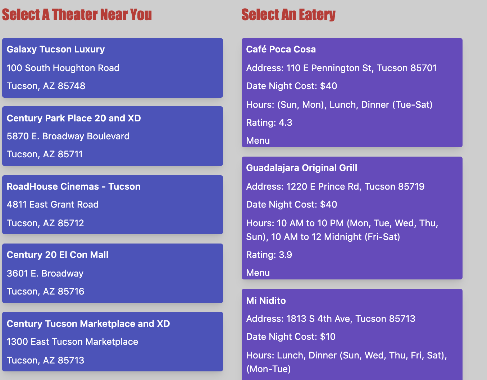

# Team-Grass

https://daellarrek.github.io/Team-Grass/

The name of the 'Team-Grass' project #1 is Movie Eaters! This applications allows its users to use their time more efficiently during a movie night out. Using geo location and mapquest, this application will display movie theaters in the users area. If the user denies to share their 'Know your location' alert, they will have to input their zip code in order to view nearby movie theatres. If the user accepts the 'Know your location' allert, our application will display the closest five theatres nearest to the users area. The information includes the movie theatre name, adress and zip code. After the user selects a cinema, the longitude and latitude will then be stored into their local storage, where our Zomoto Api will use to display nearby eatieries. 

## Location Verification

The user will allow or deny access to their location to launch application.

## Nearby Movies

Once location is allowed or zip code has been entered, the user will see the five closest movie theaters near their location.

## Eateries Nearby

Once the user has selected their preferred movie theater, they will be shown the five closest eateries nearby. 

## Selector Option

The user is able to switch back and forth, choosing different movie theaters and being prompted with different nearby eateries.

